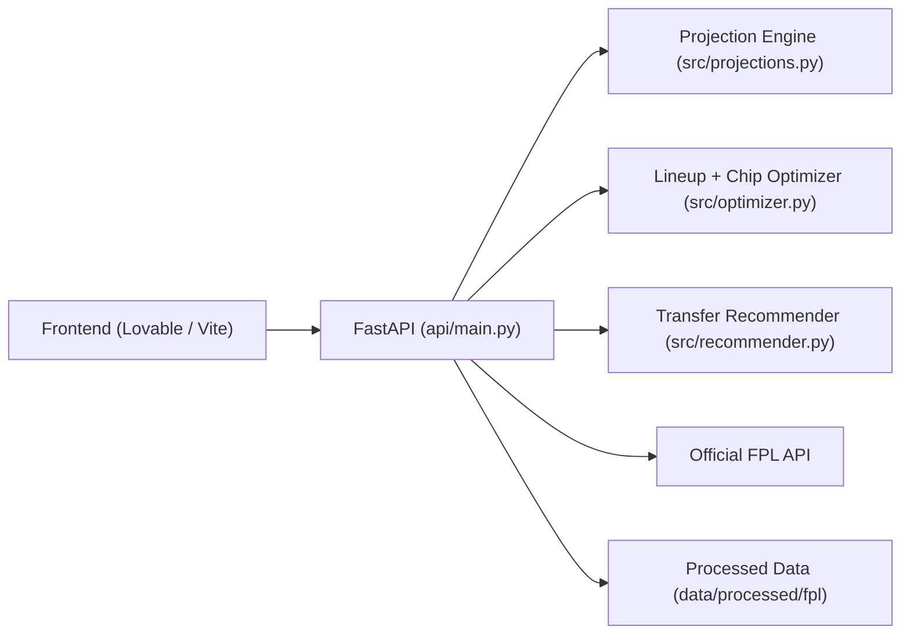

# FPL Assistant API (Backend)

FastAPI backend for the FPL Assistant product.  
It powers squad loading, xPts projections, lineup optimization, transfer planning, and chip draft scenarios (`wildcard`, `free_hit`).

## Live Demo Links

- Frontend app: `<YOUR_FRONTEND_URL>`
- Backend base URL: `<YOUR_BACKEND_URL>`
- Swagger docs: `<YOUR_BACKEND_URL>/docs`
- Loom walkthrough: `<YOUR_LOOM_URL>`

## What This Backend Does

- Loads current squad and entry history from official FPL endpoints.
- Projects player xPts across a configurable horizon.
- Optimizes starting XI, bench order, captain, and vice-captain.
- Suggests transfers with multi-move planning and transfer application steps.
- Builds chip drafts:
  - `free_hit`: optimize for next GW only.
  - `wildcard`: optimize for a setup score that blends next-fixture xPts, future double-GW upside, and premium captaincy coverage.
- Exposes evaluation endpoint for xPts vs actual points quality checks.

## Architecture Overview



## Core Endpoints

| Endpoint | Method | Purpose |
|---|---|---|
| `/health` | GET | Health probe |
| `/events/next` | GET | Next event + deadline summary |
| `/squad` | GET/POST | Load entry squad for a GW |
| `/recommendations` | GET/POST | Recommended lineup + transfers + chip strategy output |
| `/evaluation/xpts` | GET/POST | Evaluate predicted xPts vs actual points history |
| `/admin/refresh` | POST | Refresh caches and optional snapshot |

## Local Run

```bash
cd FPL
python3 -m pip install -r requirements.txt
uvicorn api.main:app --reload --port 8001
```

Local URLs:

- `http://127.0.0.1:8001/docs`
- `http://127.0.0.1:8001/health`

## Example Calls

```bash
curl "http://127.0.0.1:8001/squad?entry_id=1234567&event_id=31"
curl "http://127.0.0.1:8001/recommendations?entry_id=1234567&event_id=31&horizon_gws=3&include_transfers=true"
curl "http://127.0.0.1:8001/recommendations?entry_id=1234567&event_id=33&chip_strategy=wildcard&chip_horizon_gws=5"
curl "http://127.0.0.1:8001/recommendations?entry_id=1234567&event_id=33&chip_strategy=free_hit&horizon_gws=1"
curl "http://127.0.0.1:8001/evaluation/xpts?window=3&min_gw=2&topk=25"
```

## Key Response Fields

From `/recommendations`:

- `starting_xi`, `bench`, `formation`, `captain_player_id`, `vice_player_id`
- `projected_points_with_captain`
- `transfers` (moves, hot targets, plan metadata)
- `squad_with_transfers_steps` (instant apply step 0..N for frontend)
- `chip_strategy` (selected chip mode, objective, budget, remaining budget, explanation/profile)
- `strategy_recommendation` (roll / transfer / chip action block)
- `timings_ms` (latency instrumentation per stage)

## Environment Variables

| Variable | Description |
|---|---|
| `FPL_API_KEY` | Optional API key required for public access |
| `FPL_ADMIN_KEY` | Admin key for `/admin/refresh` |
| `FPL_API_CORS_ORIGINS` | Comma-separated allowed frontend origins |
| `FPL_ENTRY_ID` | Default entry ID fallback |
| `FPL_SNAPSHOT_OUT_BASE` | Output path for refresh snapshots |

## Data + Evaluation

- Refresh season history dataset:
  - `python3 -m src.season_history --resume`
- Baseline backtest script:
  - `python scripts/backtest_baseline.py`
- API evaluation endpoint:
  - `/evaluation/xpts` returns MAE, RMSE, bias, rank correlation, top-k overlap.

## Deployment

- Dockerized backend (`Dockerfile`).
- Azure Container Apps workflows in `.github/workflows/`.
- Scheduled refresh workflow can call `/admin/refresh`.
- Production details: `docs/production_azure.md`.

## Repo Structure

- `api/main.py` — API routes and orchestration
- `src/projections.py` — xPts projection pipeline
- `src/optimizer.py` — lineup and chip draft optimization
- `src/recommender.py` — transfer planning logic
- `src/config.py` — model and strategy tuning parameters
- `scripts/` — refresh/backtest/util scripts

## Related Repos

- Frontend: `<YOUR_FRONTEND_REPO_URL>`
