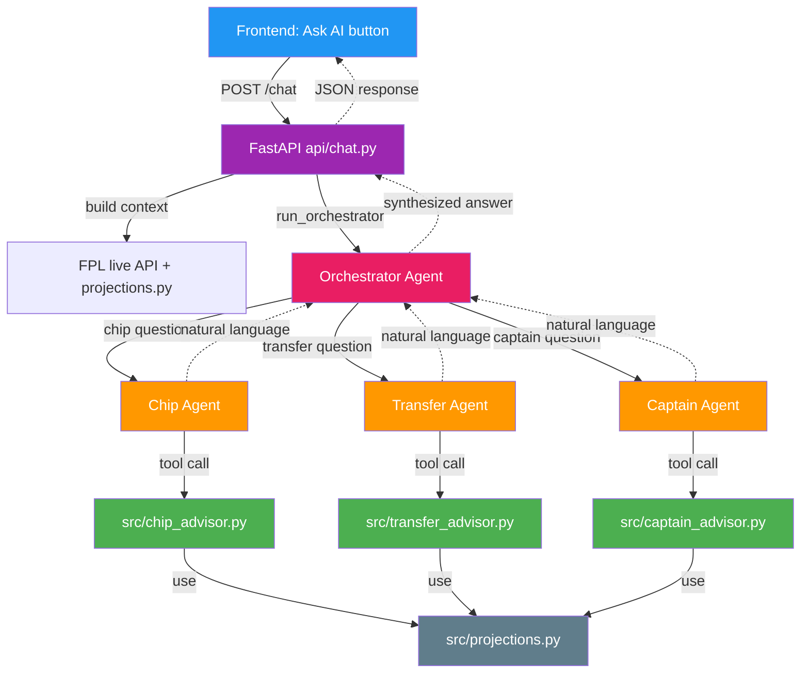

# FPLedge Agent Architecture

This document describes how the agent system works end-to-end.

## High-level flow



## Three layers

### Layer 1: Deterministic engines (Python, no LLM)
Live in `src/`. Pure math, instant, free.

| File | Purpose |
|------|---------|
| `src/projections.py` | xPts projections per player per GW |
| `src/chip_advisor.py` | Ranks chip × GW combinations by expected value |
| `src/transfer_advisor.py` | Ranks 1-for-1 transfers by multi-GW gain |
| `src/captain_advisor.py` | Ranks captain candidates from a starting XI |

These return structured `*Recommendation` dataclasses with `expected_value`, `confidence`, and `reasoning` facts.

### Layer 2: Specialist agents (LLM wrappers)
Live in `agents/`. Each wraps one engine with a Claude API call.

| File | Wraps | Decides |
|------|-------|---------|
| `agents/chip_agent.py` + `.md` | `chip_advisor.py` | Play chip now or hold? Which chip? |
| `agents/transfer_agent.py` + `.md` | `transfer_advisor.py` | Transfer, hit, or roll? |
| `agents/captain_agent.py` + `.md` | `captain_advisor.py` | Captain + vice pick |

The `.md` file is the **system prompt** (rules, context, output format).
The `.py` file is the **runner** (Claude API call + tool-use loop).

### Layer 3: Orchestrator (top-level agent)
`agents/orchestrator.py` + `.md`. Receives a user question, routes to one or more specialists, synthesizes a final answer.

Tools available to the orchestrator: `ask_chip_agent`, `ask_transfer_agent`, `ask_captain_agent`.

## API endpoint

`POST /chat`

```json
{
  "entry_id": 1234567,
  "message": "Should I play my Wildcard this week?",
  "current_gw": 10
}
```

Returns:

```json
{
  "answer": "Hold your Wildcard. The engine projects +85 pts uplift if you wait until GW12 ...",
  "current_gw": 10,
  "latency_ms": 4123
}
```

## Why this architecture

**Separation of concerns:**
- Math lives in advisors. Testable, deterministic, free.
- LLM judgment lives in agents. Adds reasoning over context, explains decisions.
- Routing lives in orchestrator. Lets users ask natural questions without picking the right tool.

**Cost control:**
- Agents only fire on user action (Ask AI button or chat). Not on every page load.
- Advisors run all the time in the backtest (free).
- Each agent call costs ~$0.01-0.03 with Sonnet 4.6.

**Backtest compatibility:**
- The advisors are imported directly by `scripts/backtest_season.py` — no LLM in the loop.
- Agents are for **live recommendations only**, never in the backtest.

## Backtest vs Live App

| | Backtest | Live App |
|--|----------|----------|
| Data source | Vaastav 2025/26 CSV files | Live FPL API |
| Projection | `src/projections.py` via `backtest_adapter` | `src/projections.py` direct |
| Advisor | Called directly (deterministic) | Called via agent tools |
| Agents | NOT used (cost + speed) | Used via `/chat` |
| Output | CSV log | JSON to frontend |

## Where the diagram lives

The Mermaid diagram at the top of this file renders automatically in:
- GitHub (markdown preview)
- VS Code (with Markdown Preview Mermaid Support extension)
- Claude (paste this file and ask for analysis)
- Most modern markdown viewers
