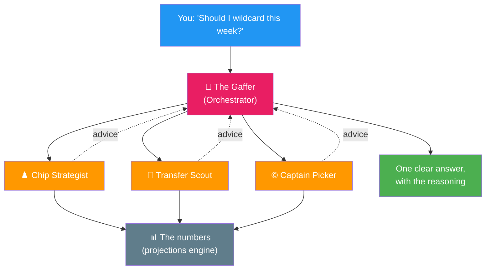

# I Gave My FPL Team a Backroom Staff of AI Agents — Part 1

*Follow-up to ["I'm Building My Own FPL Decision Engine"](https://ziadnader1.substack.com/p/im-building-my-own-fpl-decision-engine). Back then it was a dream and a few API calls. This season it actually ran my team — and I finished **top 75K**. This is how the agents work. Part 2 is the season they had.*

---

We've all been there.

It's Friday night, 11:58pm, deadline two minutes away. You've got Haaland or Salah for the armband. Your gut says one. Twitter says the other. Your mini-league rival has already triple-captained. You pick, you flinch, and on Saturday at 3:01pm you watch the *other* one bury a hat-trick while yours gets subbed on the 70th.

That feeling — that specific, soul-destroying FPL feeling — is the entire reason this thing exists.

Because here's what I finally admitted to myself: my problem was never *information*. I read the previews. I knew the fixtures. My problem was that at 11:58pm, tired and tilted and scared of my rival, I make bad decisions. Every. Single. Week.

So I stopped trying to be a better manager. Instead, I hired a backroom staff that never gets tired, never tilts, and never captains on vibes.

They're AI agents. And this season, they were *good*.

---

## Meet the backroom staff

Most "FPL AI tools" are one big model that spits out a number. Mine isn't. It's a **team of specialists** that each obsess over one job — exactly like a real backroom at a club. One question comes in, it gets routed to the right people, they do their work, and a manager pulls it all together into one answer.

> *[screenshot: the "Ask AI" panel in the app — a real question + the answer]*

Here's the staff:

**🧠 The Gaffer (Orchestrator).** You ask him anything — *"should I wildcard this week?"*, *"who do I captain?"*, *"is Palmer a sell?"* — and he decides which of his specialists to bring in, then gives you the final word. You never have to know who to ask. You just ask.

**♟️ The Chip Strategist.** Lives and breathes Wildcards, Bench Boosts, Triple Captains and Free Hits. His one obsession: *not now, or now?* He'll happily tell you to sit on your wildcard for four more weeks if the fixtures aren't ripe.

**🔁 The Transfer Scout.** Doesn't chase last week's haul. He thinks in *sequences* — "make this move now and it sets up that move next week." He's the one who stops you panic-selling a good player after one blank.

**©️ The Captain Picker.** Cares about one thing: ceiling. Not the safe pick — the *right* pick. He's the reason I was on Foden before half of Twitter woke up to him.

And quietly, in the background:

**📓 The Analyst (Reflection).** After every gameweek he reviews what the staff got wrong, writes it down, and makes sure they don't make the same mistake twice. More on him in Part 2 — he was worth an absurd number of points.

*The backroom staff. You talk to the Gaffer. He runs the room.*

> *[screenshot: render the diagram above and drop it in — or screenshot the agent panel in the tool]*

---

## The one rule that makes it trustworthy

Here's the bit I'm most proud of, and it's the difference between this and a chatbot that confidently makes things up:

**The agents are not allowed to invent numbers.**

The actual maths — every projected point, every transfer's expected gain — is done by plain, boring, deterministic code underneath each agent. The AI's job isn't to *guess* how many points Saka will score. It's to take the engine's honest projection and **reason about it** — weigh the risk, explain the call, tell you *why* in human language.

So when the Captain Picker says *"go Foden, not Salah"*, there's a real number behind it — and an explanation you can argue with.

> *[screenshot: a captain recommendation showing the reasoning + the expected points behind it]*

That's the whole philosophy: **the machine does the maths, the AI does the talking, and you make the final call with actual reasons instead of 11:58pm panic.**

---

## How do I know they're any good?

Fair question. Anyone can build a tool that *feels* smart.

So I made the staff replay the **entire season**, gameweek by gameweek — but with a strict rule: at every step they only know what had actually happened *up to that point*. No cheating, no looking at the future. Then I compared their decisions against what really happened... and against my own actual picks.

That backtest is the reason I eventually shut up and let them run my team. When you watch, in cold numbers, the AI's captain and transfer calls beat your gut week after week, it gets a lot easier to stop overruling them at 11:58pm.

> *[screenshot: the backtest comparison chart — engine vs my own picks]*

**How big was the gap? And which exact calls dragged me into the top 75K?**

That's Part 2 — the season the backroom staff actually had. The captain pivots, the transfers that moved my rank, the chip timing, and the quiet analyst who turned out to be the MVP.

---

*Part 2 dropping next. Subscribe if you want the gameweek-by-gameweek receipts — and the bit where the AI's memory layer outscored me by nearly 100 points.*
