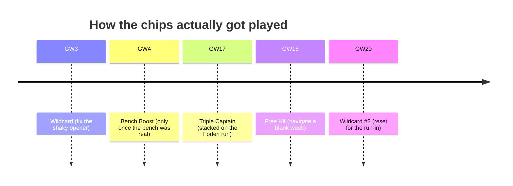

# The Season My AI Backroom Staff Took Me to Top 75K — Part 2

*Part 1 introduced the staff: the Gaffer, the Chip Strategist, the Transfer Scout, the Captain Picker, and a quiet Analyst in the background. This is the season they had — with receipts.*

---

Let me give you the number first, because it's the only one that matters.

I replayed the whole season two ways: once with my own actual decisions, and once letting the backroom staff run the team. Same starting squad, same fixtures, same everything — only the decisions changed.

**Me, on my own: ~1,344 points by GW29.**
**The staff (with their memory switched on): ~1,440.**

That's **+96 points**. About **three or four a week**.

I know — three points a week sounds like nothing. But that's exactly the trap. Three points a week, every week, no disasters, is the entire difference between bobbing around the half-million mark and breaking into the **top 75K**. It's not won in one heroic gameweek. It's won by *not losing it* in the boring ones.

> *[screenshot: the cumulative-points chart, me vs the staff — make this the big hero image]*

Here's where those points came from.

---

## The Captain Picker won me the season

If you fix one thing in your FPL life, fix your armband. It's the swingiest call you make every week, and it's where my gut did the most damage.

The Captain Picker had one obsession — *ceiling* — and the guts to be early:

- **Early doors, it backed Semenyo** while everyone else was still on the obvious names. Paid off with an **18-point armband haul in GW7.**
- **Then it pivoted to Foden** right as he caught fire — and rode him to a **90-point gameweek (GW15)**, 71 the week after. The best part? It had been quietly raising his projection for weeks. It wasn't a punt. It saw it coming.
- **For the run-in it settled on João Pedro**, banking double-digit hauls while the template chased ghosts.

> *[screenshot: the captain agent's reasoning for the Foden pick — proof it was on him before the crowd]*

The lesson I keep relearning: **the points are made by being early, and being early feels horrible.** A backtested model is what gives you the nerve to click it anyway.

---

## The Transfer Scout: boring on purpose

This is the unsexy one, and it's where the slow, grinding gains lived.

The Scout doesn't chase. Across the whole season it:

- **Refused to panic-sell.** One blank into a tough fixture? It held and rolled. Saved me from myself more times than I'd like to admit.
- **Rolled transfers on purpose** when no move was worth it — banking the free transfer for a week that actually mattered.
- **Bought paths, not players** — lining up a move *this* week because of the fixture swing *next* week.
- **Took zero hits all season.** Not one -4.

> *[screenshot: a multi-week transfer plan from the tool]*

Every one of those is the *opposite* of an exciting FPL decision. And that's the point. The exciting transfers — the rage-buys, the -8 to chase a hat-trick — are the ones that wreck your rank.

---

## The Chip Strategist: it's all in the timing

Anybody can play a chip. The points are in *when*.

Look at GW17. It didn't just "use" the Triple Captain — it **stacked it on top of the Foden purple patch**, when the ceiling was already at its highest. That's the whole game: **chips amplify a good position, they don't rescue a bad one.** The Strategist waited every time, even when sitting on a chip felt like leaving points on the table.

---

## The MVP was the one I almost didn't build

Remember the quiet Analyst from Part 1? The one who reviews every gameweek and writes down what went wrong?

He's most of that +96.

Because here's the ugly truth about my FPL career: **most of my worst decisions were repeats of earlier worst decisions.** The same emotional sell in GW20 that I'd already made in GW8. The same captain-on-form trap. The same chip panic.

The Analyst logged each mistake *once* — and then made sure the staff never made it again. I, a human, kept stepping on the same rake all season. He stepped on it once and moved the rake.

> *[screenshot: a reflection note / memory entry — a lesson the staff fed back into themselves]*

That feedback loop is the closest thing FPL has to a cheat code, and it's not even about being smarter. It's just about not being dumb *twice*.

---

## What a season of trusting the staff taught me

1. **It's a discipline game, not a knowledge game.** The projections weren't magic. Never tilting was.
2. **You have to measure it**, or you'll overrule it every time it disagrees — and it was usually right.
3. **Let it be early.** The biggest hauls all felt uncomfortable when I clicked them.
4. **Boring compounds.** No hits, patient chips, three points a week. Then you look up and you're in the top 75K.

---

## Where the staff goes next season

- A proper **minutes model** so it stops trusting players who don't start.
- **Differential math** built for mini-leagues — beating *your rivals*, not just the average.
- An **injury-news reader** so it digests team news the way I would, except it won't forget it by Saturday.

But the core lesson is already banked. FPL rewards good decisions made calmly, under pressure, over and over — and that turns out to be the one thing I'm worse at than a piece of software.

So this season, I built a backroom staff I could trust. Then I did the hardest thing an FPL manager can do.

I got out of their way.

---

*Missed Part 1 — how the agents actually work? It's [here](https://ziadnader1.substack.com/p/im-building-my-own-fpl-decision-engine). Subscribe for next season's build, and tell me your worst 11:58pm captaincy decision in the comments. I'll go first.*
